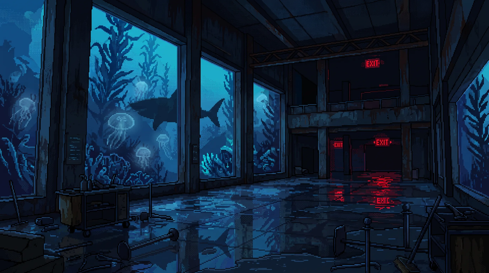
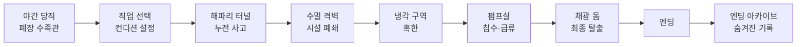
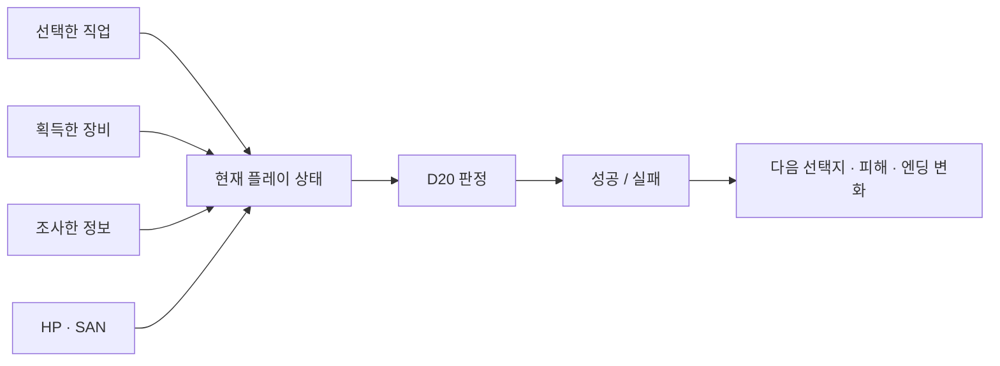
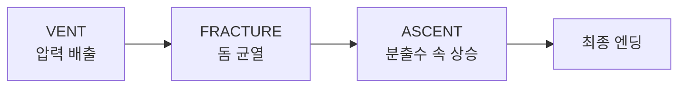
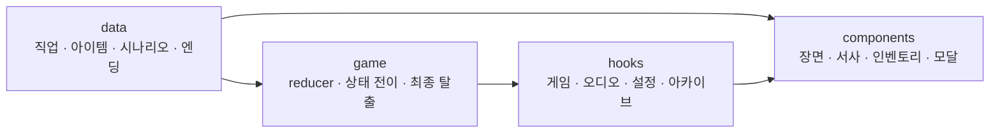
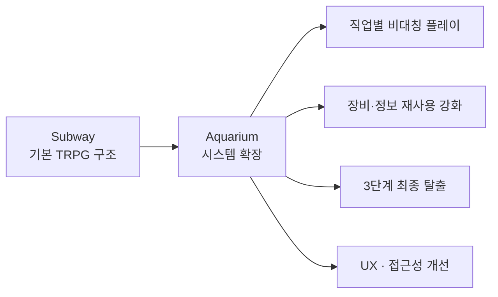

# 아쿠아리움: 심해의 균열

> **폐장한 수족관에서 침수 경보가 울렸다.
> 지상으로 돌아가기 위해서는, 이미 무너지기 시작한 시설을 통과해야 한다.**

`아쿠아리움: 심해의 균열`은 직업별 특성과 제한된 조사, D20 판정으로 폐장 후의 아쿠아리움을 탈출하는 **React 기반 텍스트로그 생존 TRPG**입니다.

각 구역에서 무엇을 조사했는지, 어떤 장비를 챙겼는지, 어떤 직업을 선택했는지가 이후의 판정과 최종 탈출 방식에 직접 영향을 줍니다.

<p align="center">
  <a href="https://aquarium-trpg.vercel.app/"></a>
  <a href="https://github.com/tichieeee1023/subway-trpg"></a>
</p>

<p align="center">
  
  
  
  
  
</p>

<p align="center">
  
</p>

---

## 목차

* [프로젝트 개요](#프로젝트-개요)
* [어떤 게임인가요?](#어떤-게임인가요)
* [게임 진행](#게임-진행)
* [직업에 따라 달라지는 생존 방식](#직업에-따라-달라지는-생존-방식)
* [조사와 장비는 한참 뒤에 다시 쓰입니다](#조사와-장비는-한참-뒤에-다시-쓰입니다)
* [3단계 최종 탈출](#3단계-최종-탈출)
* [엔딩 아카이브](#엔딩-아카이브)
* [React로 어떻게 만들었나요?](#react로-어떻게-만들었나요)
* [프로젝트 구조](#프로젝트-구조)
* [플레이 편의와 접근성](#플레이-편의와-접근성)
* [테스트와 검증](#테스트와-검증)
* [실행 방법](#실행-방법)
* [첫 번째 게임에서 무엇을 확장했나요?](#첫-번째-게임에서-무엇을-확장했나요)

---

## 프로젝트 개요

|     |                                        |
| --- | -------------------------------------- |
| 장르  | 브라우저에서 바로 플레이하는 한국어 텍스트로그 생존 TRPG      |
| 배경  | 폐장 후 침수 경보가 울린 도심 아쿠아리움                |
| 플레이 | 4개 직업 · 5개 구역 · 구역별 제한 조사 · D20 판정     |
| 핵심  | 직업·조사·장비가 이후의 선택지와 판정을 변화              |
| 목표  | 압력 배출 → 돔 파쇄 → 수면 상승의 3단계 최종 탈출        |
| 저장  | 엔딩 아카이브는 브라우저에 저장, 플레이 로그는 JSON으로 내려받기 |

이 게임의 중심은 예쁜 수족관을 구경하는 것이 아니라,

> **내가 고른 직업과 조사·장비 때문에 이런 방식으로 살아남았다는 감각**

입니다.

모든 장소를 조사할 수 없기 때문에 무엇을 챙기고 무엇을 포기할지 선택해야 하며, 그 결과가 한참 뒤의 위기에서 다시 돌아옵니다.

---

## 어떤 게임인가요?

* 🧑‍🔧 **4개의 서로 다른 직업**
  같은 사건에서도 직업에 따라 유리한 능력치와 해결 방법이 달라집니다.

* 🔎 **제한된 조사**
  한 구역의 모든 장소를 확인할 수 없습니다. 생존 도구, 정보, 회복, 위험 중 무엇을 선택할지 결정해야 합니다.

* 🎒 **장비와 정보의 재사용**
  이전에 획득한 아이템이 후속 판정의 DC를 낮추거나, 피해를 줄이거나, 다른 해결 방법을 엽니다.

* 🎲 **D20 판정**
  직업 능력치와 현재 상태, 장비 보정이 결과에 함께 반영됩니다.

* 🌊 **3단계 최종 탈출**
  마지막 장면을 한 번의 판정으로 끝내지 않고 서로 다른 방식의 세 위기로 나눴습니다.

* 📚 **7개의 엔딩**
  엔딩을 수집하고 모두 확인하면 숨겨진 기록과 완주 연출이 열립니다.

---

## 게임 진행



각 스테이지는 독립된 미니게임이 아닙니다.

해파리 터널의 전기 사고가 시설 폐쇄로 이어지고, 폐쇄된 동선이 냉각 구역과 침수된 펌프실을 거쳐 최종 돔의 탈출로 연결됩니다.

한 사건이 다음 위기를 만들어내는 흐름을 유지했습니다.

---

## 직업에 따라 달라지는 생존 방식

네 직업은 단순히 이름만 다른 캐릭터가 아닙니다.

| 직업     | 강점              |
| ------ | --------------- |
| 아쿠아리스트 | 완력과 물리적 파쇄      |
| 다이버    | 침수·누전·수중 환경 대응  |
| 수의사    | 분석과 SAN 관리      |
| 보안요원   | 시설 제어와 방재 장비 활용 |

직업별 특성은 같은 보너스를 조금씩 나눠 가진 형태가 아니라, **특정 위기에서 전혀 다른 해결 방법이 나타나도록 비대칭적으로 설계**했습니다.



예를 들어 일반 플레이어에게 STR 판정이 필요한 상황에서도 특정 직업은 DEX 기반의 별도 해결 경로를 사용할 수 있습니다.

따라서 재플레이 시 단순히 다른 숫자로 같은 게임을 반복하기보다 **다른 생존 방식**을 발견하게 됩니다.

---

## 조사와 장비는 한참 뒤에 다시 쓰입니다

아쿠아리움에서 중요하게 다룬 부분 중 하나는

> “아이템을 얻었는데 인벤토리에만 들어 있고 끝나는 것”

을 피하는 것이었습니다.

주요 장비와 조사 정보는 이후의 사건에서 다시 사용됩니다.

```text
조사
↓
아이템 / 정보 획득
↓
한참 뒤 위기 발생
↓
이전 준비가 다시 등장
↓
판정 또는 피해 변화
↓
결과
```

예를 들어:

* **방수 펜라이트** → 냉각기 우회 배선을 확인해 판정 난이도를 낮춤
* **랜턴** → 물속 흡입 그릴의 위치를 미리 확인
* **방한 조끼** → 냉각 구역 실패 시 동상 피해 감소
* **보안 키 태그** → 방재 장비 보관함의 잠금을 먼저 해제
* **마스터 키카드** → 최종 압력 배출 장치의 잠금 해제 보조
* **육각 렌치** → 아크릴 균열 단계에서 파쇄 도구로 활용

### 장비 효과는 결과 숫자만 바꾸지 않습니다

아이템이 실제 상황에 개입할 때는 아이템 이미지를 포함한 별도의 장비 효과 모달을 보여줍니다.

장비의 역할에 따라 연출 순서도 다릅니다.

#### 장비가 행동의 원인일 때

```text
장비 사용
→ 상황 변화
→ 판정
→ 결과
```

예를 들어 펜라이트로 배선을 먼저 확인하거나, 키 태그로 잠금을 먼저 해제하는 경우입니다.

#### 장비가 실패 결과를 막아줄 때

```text
실패 발생
→ 장비 효과
→ 감소된 피해
```

방한 조끼처럼 이미 발생한 피해를 완화하는 장비는 결과 이후에 등장합니다.

이를 통해 플레이어가

> “아까 챙긴 그 장비가 여기서 쓰였구나.”

를 직접 느낄 수 있도록 했습니다.

---

## 3단계 최종 탈출

최종 장면은 장비를 충분히 모았는지만 확인하는 단일 판정으로 끝내지 않습니다.



### 1. VENT — 압력 배출

수압이 높아진 돔 내부에서 먼저 배출 장치를 작동시켜야 합니다.

직업, 시설 정보, 키카드 등 이전 준비가 판정에 영향을 줍니다.

### 2. FRACTURE — 돔 파쇄

이미 손상된 아크릴 돔의 균열을 확대합니다.

보유한 공구에 따라 판정 난이도와 접근 방식이 달라집니다.

### 3. ASCENT — 상승

파손된 돔으로 물이 한꺼번에 쏟아지는 상황에서 마지막으로 수면까지 올라가야 합니다.

앞선 두 단계의 실패와 현재 상태가 마지막 생존 결과에 반영됩니다.

최종전을 여러 단계로 나눈 이유는

> **마지막 버튼 한 번으로 탈출하는 대신, 내가 준비해온 것들을 끝까지 사용하게 만들기 위해서**

입니다.

---

## 엔딩 아카이브

총 7개의 엔딩을 수집할 수 있습니다.

확인한 엔딩은 브라우저에 저장되며, 플레이 회차를 다시 시작해도 엔딩 수집 기록은 유지됩니다.

모든 엔딩을 수집하면 숨겨진 기록이 열리고, 이후 메인 화면에서 완주 일러스트와 Canvas 폭죽 연출을 확인할 수 있습니다.

개발 및 검증을 위한 전체 해금 기능도 별도로 제공합니다.

* PC: **`Ctrl + Shift + F10`**

실행 후 확인 모달에서 전체 해금을 선택하면 모든 엔딩 기록을 바로 확인할 수 있습니다.


---

## React로 어떻게 만들었나요?

게임 진행에서 가장 복잡했던 부분은 화면 자체보다 **서로 영향을 주는 상태의 수**였습니다.

플레이 중에는 다음 정보가 동시에 관리됩니다.

* 직업
* 능력치
* HP / SAN
* 행동력
* 현재 Stage
* 조사 완료 장소
* 인벤토리
* 획득한 정보
* 시나리오 플래그
* D20 판정 결과
* 최종 탈출 진행 단계
* 누적 실패
* 엔딩 조건

이를 reducer와 hooks를 중심으로 관리하고, 시나리오 데이터와 화면 컴포넌트를 분리했습니다.

```text
사용자 선택
→ Game State 변경
→ 현재 조건 재평가
→ 선택지 / DC / 피해 변화
→ React UI 재렌더링
```

이 프로젝트의 핵심은 실시간 물리나 3D 공간 이동보다

**선택 → 상태 변화 → 조건 평가 → 화면 변화**

이기 때문에 별도의 게임 엔진 대신 React의 상태 관리 구조를 게임 시스템으로 활용했습니다.

---

## 프로젝트 구조



```text
src/
├── components/  # 레이아웃, 장면·서사, 인벤토리, 아카이브, 설정, 크레딧
├── data/        # 직업, 아이템, 시나리오, 장면, 엔딩
├── game/        # 초기 상태, reducer, 상태 전이, 최종 탈출
├── hooks/       # 게임 연결, 오디오, 설정, 엔딩 수집
└── utils/       # D20 판정 및 공통 게임 규칙

public/assets/   # 인물·장면·엔딩·아이템 WebP 이미지
```

`data`는 게임에 무엇이 존재하는지를 정의하고, `game`은 그 데이터가 어떤 규칙으로 상태를 바꾸는지 담당합니다.

`hooks`는 게임 상태와 React 화면을 연결하며, `components`는 현재 상태를 사용자에게 보여주는 역할에 집중합니다.

이 구조를 통해 시나리오나 밸런스를 수정할 때 화면 컴포넌트 전체가 함께 얽히지 않도록 했습니다.

---

## 플레이 편의와 접근성

후속작을 만들면서 단순히 시스템을 늘리는 것뿐 아니라 **실제로 여러 회차를 플레이할 때 불편한 지점**도 함께 정리했습니다.

### 반복 플레이

* 홈 이동 후 이어하기
* 현재 회차만 다시 시작
* 엔딩 아카이브 보존
* 주사위 / 화면 효과 제어
* 완료 후 축하 연출

### 모바일

* 모바일 인벤토리 접근
* 선택지 터치 영역 조정
* 긴 아이템명 처리
* 모달 내부 스크롤
* 이미지 우선 레이아웃
* 한국어 제목 줄바꿈 보완

### 접근성

* `prefers-reduced-motion` 대응
* 플래시·암전·화면 효과 감소
* 설정에서 효과 ON / OFF
* 위험 정보와 실제 조작 버튼의 강조색 분리

---

## 브라우저 기능 활용

별도의 게임 엔진을 사용하지 않고 브라우저 API를 직접 조합했습니다.

### Web Audio API

오디오 파일 대신 브라우저에서 다음 효과음을 합성합니다.

* 클릭
* 도구 사용
* D20 판정
* 장면 전환
* 구역 진입

### Canvas

모든 엔딩을 수집한 뒤의 완주 폭죽 연출에 사용합니다.

### Local Storage

엔딩 아카이브와 사용자 설정을 현재 회차와 별도로 저장합니다.

### matchMedia

`prefers-reduced-motion`을 확인해 움직임과 화면 효과를 줄입니다.

---

## 테스트와 검증

게임 규칙은 UI와 분리해 자동으로 검증할 수 있도록 구성했습니다.

주요 테스트 범위는 다음과 같습니다.

* D20 판정
* 상태 전이
* 조사 제한
* 아이템 획득 및 사용
* 직업별 특수 효과
* 장비에 따른 DC 변경
* 보호 장비의 피해 감소
* 정보 플래그 적용
* 최종 탈출 3단계
* 엔딩 분기
* 저장된 엔딩 기록

장비 효과를 수정할 때는 단순히 테스트 통과 여부만 보는 것이 아니라,

```text
아이템 획득
→ 사용 가능 시점
→ 장비 효과 모달
→ 실제 판정
→ 결과
```

의 순서가 자연스러운지도 함께 확인했습니다.

---

## 실행 방법

```bash
npm install
npm run dev -- --port 5174
```

검증:

```bash
npm run lint
npm test
npm run build
node tools/verify-aquarium-browser.mjs
```

이미지 최적화:

```bash
npm run optimize:images
```

---

## 첫 번째 게임에서 무엇을 확장했나요?

`아쿠아리움: 심해의 균열`은 첫 번째 텍스트로그 TRPG인 **심야 지하철: 사라진 다음역**을 만든 뒤 시작한 후속 프로젝트입니다.

첫 작품에서 만든

* 제한 조사
* AP
* D20 판정
* HP / SAN
* 인벤토리
* 시나리오 플래그
* 다중 엔딩

구조를 기반으로, 두 번째 게임에서는 다른 부분을 더 깊게 실험했습니다.



특히 아쿠아리움에서는 **플레이어가 어떤 직업을 골랐는지와 무엇을 준비했는지가 최종 탈출 방식에 더 강하게 드러나도록** 설계했습니다.

그리고 이 프로젝트를 만들면서 개선한

* 모바일 인벤토리
* 장비 효과 모달
* 반복 플레이 편의 기능
* 접근성 설정
* 엔딩 완주 경험
* 정보 피드백

등은 다시 첫 번째 게임인 `심야 지하철`에도 적용했습니다.

두 프로젝트는 완전히 독립된 결과물이 아니라,

> **첫 작품에서 만든 구조를 두 번째 작품에서 확장하고, 후속작에서 얻은 경험을 다시 첫 작품에 반영한 연속된 개발 과정**

으로 이어져 있습니다.

---

<details>
<summary><strong>상세 개발 기록 · 2026-09-18–19</strong></summary>

### 플레이 설계에서 지킨 기준

* **사건의 인과관계**
  스테이지를 조사·주사위·전환의 반복으로 만들지 않고, 한 사건이 다음 위험을 불러오는 탈출 흐름으로 연결했습니다.

* **선택의 결과**
  제한된 조사 행동, 직업, 발견한 도구와 위험 정보가 후속 판정·피해·대체 경로에 영향을 줍니다.

* **직업별 비대칭**
  아쿠아리스트의 완력, 다이버의 수중 생존, 수의사의 분석·공포 저항, 보안요원의 시설 대응은 서로 다른 재플레이 경험을 위한 특권입니다.

* **아이템은 자동 성공이 아님**
  장비는 판정 난이도나 피해를 조정하고 특수 경로를 열지만, 최종 탈출에서는 압력 해제·돔 파쇄·지상 탈출의 세 행동을 직접 수행합니다.

* **짧은 정보, 강한 장면**
  일반 설명은 빠르게 읽히도록 줄이고, 이미지·효과음·주사위·상태 변화로 위험을 전달합니다.

### 플레이·상태 시스템

* 탐사, 인벤토리, 판정, 엔딩 결과를 게임 상태와 데이터로 분리했습니다.
* 시나리오 데이터와 화면 컴포넌트를 나눠 구역별 사건을 수정해도 UI 전체가 얽히지 않도록 했습니다.
* SAN 회복, 재시도 DC 감소처럼 놓치기 쉬운 수치 효과는 별도로 강조합니다.
* 모바일에서는 아이템 획득 알림과 선택지 폭을 조정했습니다.

### 장면·반응형

* PC에서도 장면 이미지를 먼저 크게 보여주고 설명은 이미지 아래에서 펼치도록 했습니다.
* 한국어 제목이 어절 중간에서 끊기지 않도록 줄바꿈을 보완했습니다.
* 헤더 아이콘의 시각적 중심과 모바일 터치 크기를 조정했습니다.
* 경고 정보와 실제 행동 버튼의 강조색을 분리했습니다.

### 엔딩·아카이브

* 7개 엔딩을 모두 모은 뒤 숨겨진 기록과 감사 화면을 확인할 수 있습니다.
* 엔딩 기록은 게임 재시작과 별도로 `localStorage`에 저장합니다.
* 히든 기록 모달을 열면 스크롤 위치를 처음으로 초기화합니다.
* 완주 일러스트는 WebP로 제공하고 작은 화면에서도 전체가 보이도록 표시합니다.

### 장비·조사 정보 피드백

* 장비가 행동의 원인인 경우 `장비 사용 → 판정 → 결과` 순서를 사용합니다.
* 보호 장비는 `위험 발생 → 장비 효과 → 감소된 피해` 순서로 보여줍니다.
* 장비 효과 모달에는 해당 아이템 이미지를 다시 사용합니다.
* 이전 조사 정보가 판정에 영향을 주는 경우 판정 전에 정보를 회상하게 합니다.
* 획득한 아이템이 후속 구간에서 실제로 사용되는지 전체 인벤토리를 다시 점검했습니다.

### 소리와 연출

* Web Audio API로 클릭·도구 동작·주사위·단계 전환음을 합성합니다.
* 다음 구역 진입음은 밝은 팡파르 대신 낮고 짧은 음으로 구성했습니다.
* 플래시와 암전은 제한적으로 사용하고 효과 감소 설정을 제공합니다.

### 회차 이어하기와 재시작

* `처음부터 다시 플레이`는 현재 회차만 초기화합니다.
* 수집한 엔딩 기록은 유지합니다.
* `홈으로 가기`는 현재 진행을 유지하고 메인 화면에서 이어갈 수 있게 합니다.

### AI 활용

기획 정리, 코드 검토, 디버깅 및 일부 제작 과정에서 다음 도구를 활용했습니다.

* OpenAI GPT
* OpenAI Codex
* Google Gemini

일부 비주얼 에셋은 생성형 AI를 활용해 제작했습니다.

AI 결과를 그대로 사용하는 것보다 프로젝트의 시나리오, 게임 규칙과 UI 흐름에 맞게 수정하고 검증하는 방식으로 활용했습니다.

</details>

---

## Developer

**Planning / Frontend Development — Lee YJ**

게임의 규칙을 단순히 코드 안에서 계산하는 데서 끝내지 않고,
**플레이어가 자신의 선택과 준비가 결과를 바꾸었다고 느낄 수 있는 인터랙션을 만들고 있습니다.**
