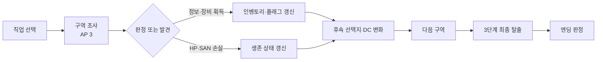
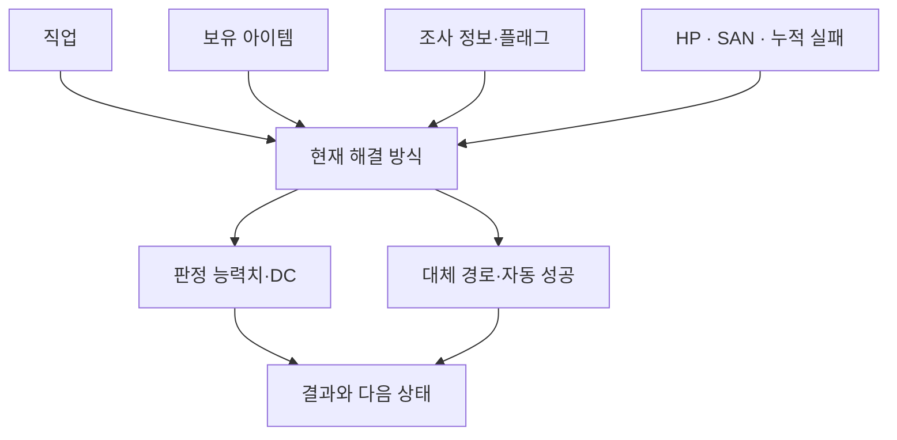
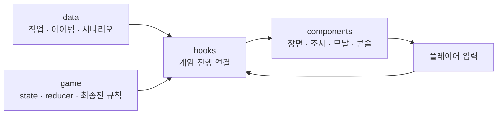

# 아쿠아리움: 심해의 균열

<p align="center">
  <strong>TEXTLOG GAME 2 · MIDNIGHT AQUARIUM · SURVIVAL TRPG</strong><br />
  폐장한 수족관에 갇힌 야간 당직자. 제한된 조사와 D20 판정으로 심해의 균열을 탈출하세요.
</p>

<p align="center">
  <a href="https://aquarium-trpg.vercel.app/"></a>
  <a href="https://github.com/tichieeee1023/subway-trpg"></a>
</p>

<p align="center">
  
  
  
  
  
</p>

<p align="center">
  
</p>

## 프로젝트 개요

|     |                                       |
| --- | ------------------------------------- |
| 장르  | 브라우저에서 바로 플레이하는 한국어 텍스트로그 생존 TRPG     |
| 배경  | 폐장 후 침수 경보가 울린 도심 아쿠아리움               |
| 플레이 | 4개 직군 · 5개 구역 · 구역마다 제한된 조사 · D20 판정  |
| 목표  | 내가 고른 직업·조사 장소·장비로 달라지는 방식으로 최종 돔을 돌파 |
| 저장  | 엔딩 도감은 브라우저에 저장. 플레이 로그는 JSON으로 내려받기  |

이 게임의 중심은 예쁜 수족관을 보는 것이 아니라, **내가 고른 직업과 조사·장비 때문에 이런 방식으로 살아남았다는 감각**입니다. 각 구역에서 조사할 수 있는 장소는 제한되어 있고, 한 사건의 결과가 다음 위기를 만들어냅니다.

동시에 이 프로젝트는 **React의 상태 관리와 조건부 렌더링을 게임 규칙 자체로 활용한 인터랙티브 프론트엔드 프로젝트**입니다.

실시간 물리나 3D 공간 이동보다 사용자 선택 이후의 상태 변화와 화면 반응이 핵심이기 때문에 별도의 게임 엔진을 사용하지 않고 React 기반 웹 애플리케이션으로 구현했습니다.

---

## 프론트엔드 프로젝트로서의 핵심

게임이라는 형식을 사용했지만, 구현의 중심에는 일반적인 프론트엔드 애플리케이션과 동일한 문제가 있습니다.

플레이 중에는 단순히 현재 화면 하나만 바뀌는 것이 아니라 다음 상태가 동시에 변화합니다.

```text
직업
HP / SAN
남은 행동력(AP)
현재 스테이지
조사 완료 장소
인벤토리
획득한 위험 정보
시나리오 플래그
D20 판정 결과
최종 탈출 진행도
엔딩 조건
```

이 값들은 서로 독립적이지 않습니다.

이전 구역에서 무엇을 조사했는지, 어떤 장비를 획득했는지, 어떤 판정에 실패했는지가 다음 장면의 선택지와 판정 난이도, 피해량에 영향을 줍니다.

```text
사용자 선택
   ↓
게임 상태 변경
   ↓
현재 조건 재평가
   ↓
선택지 / DC / 피해 / 보정 변경
   ↓
UI 재렌더링
   ↓
다음 사건 및 엔딩 변화
```

즉, 플레이 흐름 자체를 하나의 **복합적인 상태 기반 웹 애플리케이션**으로 설계했습니다.

### 왜 게임 엔진 대신 React인가

이 프로젝트의 핵심 루프는 다음과 같습니다.

```text
선택
 ↓
상태 변화
 ↓
조건 평가
 ↓
UI 변화
 ↓
다음 선택
```

실시간 충돌, 물리 시뮬레이션, 3D 렌더링보다 상태 전이와 조건부 UI가 핵심이기 때문에 Unity, Unreal, Godot와 같은 별도의 게임 엔진 대신 React를 선택했습니다.

주사위 판정, 인벤토리, 장면 전환, 모달, 엔딩 아카이브, 화면 효과, 사운드까지 브라우저 환경에서 직접 구성했습니다.

---

## 게임 디자인 목표

### 하나의 사고가 커지는 탈출극

각 스테이지를 별개의 미니게임처럼 나열하지 않습니다. 누전 사고가 시설을 망가뜨리고, 침수와 격벽 폐쇄가 이어지며, 냉동 구역과 펌프실을 거쳐 최종 돔의 탈출로 몰아갑니다.

```text
해파리 터널의 누전
        ↓
침수 · 수밀 격벽
        ↓
냉동고에 갇힘
        ↓
급류와 펌프실
        ↓
채광 돔 3단계 최종 탈출
```

### 제한된 행동이 만드는 나만의 생존 경로

각 구역의 여섯 장소 중 세 곳만 조사할 수 있습니다. 모든 장비를 모으는 대신, 위험을 미리 파악할지 생존 도구를 챙길지 직접 선택합니다. 조사한 장소, 획득한 장비, 직업 특권이 이후 판정의 난이도·피해·대체 경로를 바꿉니다.

| 직업     | 위기에서 발휘하는 특성 |
| ------ | ------------ |
| 아쿠아리스트 | 완력과 물리적 파쇄   |
| 다이버    | 침수·누전·수중 탈출  |
| 수의사    | 분석과 공포 저항    |
| 보안요원   | 시설 제어와 방재    |

직업 특권은 공평하게 똑같은 능력을 주기 위한 보너스가 아니라, 재플레이 때 다른 생존 해법을 발견하게 하는 의도된 비대칭입니다.

### 읽기보다 장면과 반응으로 전달

구역 설명과 일반 조사 결과는 짧게 유지하고, 위기와 엔딩에서만 텍스트 호흡을 늘립니다. 장면 이미지, 주사위, 도구, 플래시·암전, 효과음, HP·SAN 변화가 사건을 전달합니다. 장면 진입(`SCENE`), 조사 결과(`RESULT`), 장비 보상(`REWARD`)을 다른 모달 흐름으로 나눠 정보의 역할도 분명히 합니다.

최종전은 장비 수만 세는 단일 판정이 아닙니다. 압력 배출, 돔 파쇄, 분출수 속 탈출의 세 결정을 연속으로 수행하고, 준비한 장비와 누적 실패가 결말에 반영됩니다.

---

## 핵심 시스템

### 흐름 한눈에 보기



| 🎲 판정과 상태                          | 🧰 조사와 인벤토리                             | 📚 엔딩 아카이브                          |
| ---------------------------------- | --------------------------------------- | ----------------------------------- |
| D20, 능력치, HP·SAN 변화가 생존 분기에 반영됩니다. | 조사 선택, 도구 획득·사용, 가방 정리를 통해 탈출 경로를 만듭니다. | 7개 엔딩을 수집하고, 완주 후 숨겨진 기록을 열 수 있습니다. |

### 상태 기반 조건부 판정

같은 장면이라도 플레이어의 상태에 따라 해결 방법이 달라집니다.

```text
현재 직업
+ 보유 아이템
+ 조사 완료 여부
+ 획득한 정보
+ 현재 HP / SAN
+ 누적 실패
+ 특정 플래그
=
현재 선택 가능한 해결 방식
```

예를 들어 같은 위기에서도 다음과 같은 차이가 생길 수 있습니다.

```text
일반 플레이어
→ STR 판정

특정 직업
→ DEX 기반 대체 판정

관련 장비 보유
→ DC 감소

특수 아이템 보유
→ 자동 성공 또는 추가 경로
```



React의 조건부 렌더링을 단순히 UI를 숨기고 보여주는 기능이 아니라 **실제 게임 규칙**으로 활용했습니다.

### 아이템과 정보의 후속 활용

조사에서 얻은 장비와 정보는 인벤토리에 표시되는 것으로 끝나지 않습니다.

후속 시나리오에서 다시 참조되어 다음과 같은 효과를 만듭니다.

* 판정 DC 감소
* 실패 피해 감소
* 특수 경로 개방
* 기존 판정 대체
* 자동 성공
* 재시도 보정
* 최종 탈출 보조

정보 역시 하나의 게임 자원으로 취급합니다.

예를 들어 이전 조사에서 위험한 전선 위치를 미리 확인했다면 실제 누전 사고에서 그 정보가 후속 판정 보정으로 이어질 수 있습니다.

목표는 플레이어가

> “아까 그걸 조사한 게 여기서 이어지는구나.”

라고 느끼도록 만드는 것입니다.

---

## React 상태 관리 구조

게임 진행은 React hooks와 reducer 기반으로 관리합니다.

```text
Player Action
    ↓
dispatch()
    ↓
Reducer
    ↓
Game State Update
    ↓
현재 조건 계산
    ↓
UI Re-render
```

하나의 액션이 여러 화면과 게임 규칙에 연쇄적으로 영향을 줄 수 있습니다.

예를 들면:

```text
특정 아이템 획득
    ↓
inventory 변경
    ↓
후속 구역 진입
    ↓
아이템 보유 조건 확인
    ↓
판정 난이도 또는 선택지 변화
    ↓
결과 상태 업데이트
    ↓
최종 탈출 및 엔딩 조건에 영향
```

게임 진행을 페이지 이동 중심으로 처리하기보다 **현재 상태를 기준으로 화면이 파생되는 구조**로 구성했습니다.

---

## 데이터와 UI 분리



게임 데이터와 화면 컴포넌트가 서로 강하게 얽히지 않도록 역할을 분리했습니다.

```text
src/
├── components/
├── data/
├── game/
├── hooks/
└── utils/
```

`data`에는 직업, 아이템, 시나리오, 엔딩처럼 게임의 내용과 규칙에 가까운 정보를 두고, `components`는 현재 상태를 화면에 표현하는 역할에 집중합니다.

게임 상태 전이와 최종 탈출 규칙은 별도의 `game` 영역으로 분리했습니다.

이 구조는 시나리오가 늘어날수록 컴포넌트 내부의 `if / else`가 계속 증가하는 문제를 줄이기 위한 선택입니다.

특정 스테이지의 텍스트나 밸런스를 수정하더라도 UI 전체를 다시 수정할 필요가 없도록 구성했습니다.

---

## 기술 구성

| 영역       | 기술 및 구현                                                           |
| -------- | ----------------------------------------------------------------- |
| 프론트엔드    | React 19, JavaScript, Tailwind CSS 4, Vite 8                      |
| 인터랙션     | React hooks/reducer 기반 상태 흐름, Lucide React 아이콘                    |
| 브라우저 API | Web Audio API 사운드 합성, Canvas 폭죽, Local Storage, `matchMedia`      |
| 에셋·검증    | WebP 이미지 최적화(Sharp), Node.js Test Runner, Oxlint, Playwright Core |

게임 규칙과 시나리오 데이터를 화면에서 분리하고, 구역별 전이를 테스트할 수 있게 구성했습니다. 효과음은 오디오 파일 재생 대신 Web Audio API로 합성하며, 엔딩 수집 기록은 한 회차의 진행 상태와 독립적으로 보존합니다.

### 브라우저 API 활용

별도의 게임 엔진 대신 브라우저가 제공하는 기능을 직접 조합했습니다.

#### Web Audio API

외부 음원 파일 없이 다음 효과음을 브라우저에서 합성합니다.

* 버튼 클릭
* 도구 사용
* 주사위 판정
* 구역 전환
* 위기 효과

#### Canvas

모든 엔딩을 수집한 뒤 완주 화면에서 폭죽 연출을 구현합니다.

#### Local Storage

현재 플레이 회차와 별개로 엔딩 도감 수집 기록을 유지합니다.

#### matchMedia

`prefers-reduced-motion`을 감지해 플래시, 암전, 움직임 효과를 줄일 수 있도록 했습니다.

---

## 실행 및 검증

```bash
npm install
npm run dev -- --port 5174
```

```bash
npm run lint
npm test
npm run build
node tools/verify-aquarium-browser.mjs
```

이미지 원본을 WebP로 최적화하려면 `npm run optimize:images`를 사용합니다. 브라우저 흐름 검증 스크립트는 설치된 Google Chrome을 사용합니다.

---

## 프로젝트 구조

```text
src/
├── components/  # 레이아웃, 장면·서사, 인벤토리, 도감, 설정, 크레딧
├── data/        # 직군, 아이템, 시나리오, 장면, 엔딩 데이터
├── game/        # 초기 상태, reducer, 단계 전이, 최종전 규칙
├── hooks/       # 게임 연결, 오디오, 설정, 엔딩 수집
└── utils/       # 판정 및 공통 게임 규칙

public/assets/   # 인물·장면·엔딩·아이템 WebP 이미지
```

코드 분석과 검증 범위는 [`docs/aquarium-code-review.md`](docs/aquarium-code-review.md)에 기록했습니다.

---

## 프론트엔드에서 특히 고민한 부분

### 복잡한 상태를 화면 컴포넌트에 몰아넣지 않기

처음에는 게임 진행 조건이 많아질수록 하나의 화면에서 관리해야 할 분기가 빠르게 늘어나는 문제가 생겼습니다.

HP, SAN, AP, 조사 기록, 아이템, 직업 특성, 엔딩 조건을 모두 컴포넌트 안에서 직접 처리하면 화면과 게임 규칙이 강하게 결합됩니다.

이를 줄이기 위해 상태 전이와 게임 데이터를 분리하고, 화면에서는 현재 상태를 받아 렌더링하는 역할에 집중하도록 구성했습니다.

### 플레이어의 이전 행동이 이후 UI에 반영되도록 만들기

탐사 게임에서 아이템을 획득했는데 이후 아무 효과가 없다면 선택의 의미가 약해집니다.

따라서 주요 장비와 조사 정보는 후속 판정의 DC, 피해, 선택지, 대체 경로에 다시 사용하도록 연결했습니다.

하나의 상태 변화가 이후 여러 장면에 영향을 주게 만드는 것이 이 프로젝트의 핵심 구현 과제였습니다.

### 텍스트 게임과 UI 피드백의 균형

텍스트 게임이지만 모든 정보를 문장으로만 전달하지 않았습니다.

다음 요소를 함께 사용해 상황 변화를 표현합니다.

* 장면 이미지
* 상태 수치
* 모달 타입
* 색상
* 효과음
* 주사위 애니메이션
* 화면 플래시 및 암전
* 인벤토리 변화

이를 통해 텍스트 양을 줄이면서도 상황의 긴장감을 유지하고자 했습니다.

### PC와 모바일에서 같은 게임 규칙 유지

반응형 환경에서도 게임 규칙과 정보 순서는 동일하게 유지합니다.

모바일에서는 다음 요소를 별도로 조정했습니다.

* 인벤토리 카드 폭
* 선택지 터치 영역
* 제목 줄바꿈
* 긴 아이템명 처리
* 장면 이미지 크기
* 버튼 간격

레이아웃은 달라지더라도 플레이어가 받아들이는 정보 구조는 동일하게 유지했습니다.

---

## 개발 기록 · 2026-09-18–19

이번 작업에서 우선한 것은 화면 기술을 나열하는 일이 아니라, 플레이어가 실제로 선택하고 그 결과를 겪는 게임의 일관성입니다. 아래 구현은 그 플레이 경험을 읽기 쉽고 조작하기 쉽게 만들기 위한 작업입니다.

### 플레이 설계에서 지킨 기준

* **사건의 인과관계:** 스테이지를 조사·주사위·전환의 반복으로 만들지 않고, 한 사건이 다음 위험을 불러오는 탈출 흐름으로 연결했습니다.
* **선택의 결과:** 제한된 조사 행동, 직업, 발견한 도구와 위험 정보가 후속 판정·피해·대체 경로에 영향을 줍니다. 좋은 장비를 전부 모으는 대신 무엇을 포기할지 결정하게 합니다.
* **직업별 비대칭:** 아쿠아리스트의 완력, 다이버의 수중 생존, 수의사의 분석·공포 저항, 보안요원의 시설 대응은 서로 다른 재플레이 경험을 위한 특권입니다.
* **아이템은 자동 성공이 아님:** 장비는 판정 난이도나 피해를 조정하고 특수 경로를 열지만, 플레이어는 최종전에서 압력 해제·돔 파쇄·지상 탈출의 세 행동을 직접 수행합니다.
* **짧은 정보, 강한 장면:** 일반 설명은 빠르게 읽히도록 절제하고, 이미지·효과음·주사위·상태 변화로 위험을 체감하게 합니다. 긴 텍스트는 위기와 결말에 집중합니다.

### 플레이·상태 시스템

* 탐사, 인벤토리, 판정, 엔딩 결과를 게임 상태와 데이터로 분리하고 React 훅·reducer 기반 흐름으로 정리했습니다. 시나리오 데이터와 화면 컴포넌트를 분리해 구역별 사건을 수정해도 UI 전체가 얽히지 않도록 했습니다.
* 한 구역에서 가능한 조사 횟수, HP·SAN, 도구 사용 및 판정 결과처럼 생존에 영향을 주는 정보는 본문과 시각적으로 구분했습니다. SAN 회복이나 재시도 시 판정 난이도 하락처럼 지나치기 쉬운 수치 효과도 별도 색으로 강조합니다.
* 아이템 획득 알림이 모바일의 카드 폭을 넘지 않도록 문구와 줄바꿈을 조정했고, 선택지 두 열 배치는 한 화면에서 비교하기 쉽도록 유지했습니다.

### 반응형·접근성

* 모바일뿐 아니라 데스크톱의 장면 영역도 다시 검토했습니다. 장면 이미지는 먼저 크고 온전히 보이게 하고, 설명은 이미지 아래에서 별도로 펼치도록 분리했습니다. 작은 화면에서 제목이 단어 중간에 쪼개지지 않도록 한국어 줄바꿈 규칙도 보완했습니다.
* 헤더 아이콘의 시각적 중심을 버튼 상자 중심에 맞추고, 조작 버튼은 터치하기 충분한 크기로 조정했습니다.
* 최종전의 긴박한 경고색과 실제 선택 버튼이 경쟁하지 않도록 색을 구분했습니다. 빨강 대신 어두운 주황 계열을 사용해 위험은 유지하면서 상호작용 요소와 구별되게 했습니다.
* `prefers-reduced-motion`과 설정의 이펙트 끄기를 존중해 플래시·암전·화면 효과를 줄일 수 있도록 했습니다.

### 엔딩·아카이브·크레딧

* 7개 엔딩을 모두 모은 뒤 숨겨진 기록을 열고 메인으로 돌아오면 감사 화면과 Canvas 폭죽 연출이 이어집니다. 사용한 완주 일러스트는 WebP로 제공하고, 화면 크기에 맞춰 전체 그림이 잘리지 않게 표시합니다.
* 숨겨진 기록을 열 때 대화상자 스크롤을 맨 위로 초기화해 처음 문장부터 읽게 했습니다. 엔딩 기록은 게임 재시작과 별도로 브라우저 `localStorage`에 저장합니다.
* 엔딩 후 다시 시작할 때는 이름 `Lee YJ`를 크레딧에 한 줄로 유지하고, 특정 엔딩 내용과 맞지 않는 공통 문구는 제거했습니다.
* `SYSTEM NOTES`에는 프로젝트 제목, 기획·개발 역할, React/Vite와 게임 시스템 구성, 접근성 작업, 서체, 간결한 프로젝트 소개 및 AI 사용 고지를 정리했습니다. Codex·GPT·Gemini를 개발에 활용했고 일부 이미지는 AI로 생성했다는 점을 명시합니다.
* 메인 화면에는 다른 게임으로 가는 작은 배너를 두어 두 작품의 연결을 알리되, 메인 비주얼과 플레이 몰입을 가리지 않게 했습니다.

### 소리와 연출

* 브라우저 Web Audio API로 클릭·도구 동작·주사위·단계 전환음을 합성합니다. 다음 구역 진입음은 밝은 팡파르 대신 낮고 짧은 2음으로 정리해 상황의 긴장감과 맞췄습니다.
* 큰 장면 전환에는 플래시와 암전을 제한적으로 사용하고, 효과를 끄거나 움직임을 줄이는 사용자 설정을 제공합니다.

### 회차 이어하기와 재시작

* 플레이 중 설정에서 `처음부터 다시 플레이`를 선택하면 확인 단계를 거쳐 현재 회차만 초기화하고, 수집한 엔딩 도감은 보존합니다.
* `홈으로 가기`는 현재 탭의 진행 상태를 유지합니다. 메인 버튼은 `이어하기`로 바뀌어 중단한 회차로 돌아갈 수 있습니다. 현재 회차 상태는 메모리에 유지되며 새로고침 후 복구되는 저장 슬롯은 아닙니다.

### 주요 UX 결정

* 중요한 생존 정보와 실제 조작 요소에 같은 강조색을 쓰지 않아, 핵심 규칙은 놓치지 않으면서 버튼은 버튼답게 보이도록 했습니다.
* 장면 이미지와 설명을 한 덩어리의 좁은 2열 레이아웃에 넣지 않고, 이미지 우선·설명 접기 구조로 바꿨습니다. PC와 모바일에서 같은 정보 순서를 유지해 학습 부담을 줄입니다.
* 다시 시작은 실수로 누르지 않도록 확인을 요구하고, 홈 이동은 회차를 버리지 않도록 별도 기능으로 분리했습니다.
